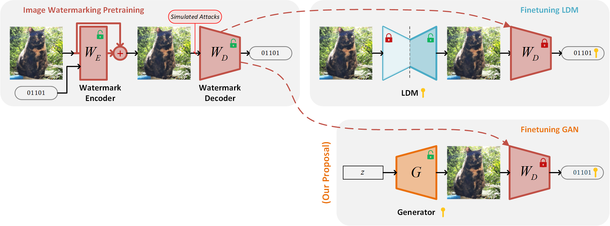

MN914 Joint Project - GAN's Signature
------

This repo is intended for storing the code for the joint project in our **M2 - Multimedia Networking** program.

The objective of the project is to apply [Stable Signature](https://ai.meta.com/blog/stable-signature-watermarking-generative-ai/)
for GAN, and we also propose a watermark encoder architecture that tries to enforce a _semantic_-level signature in
the latter fine-tuned GAN models.

<p align="center">

</p>

The final presentation of the project can be found in [`resources/final_report.pdf`](resources/final_report.pdf).

## Setup

### Requirements

See [`requirements.txt`](requirements.txt).

```cmd
pip install -r requirements.txt
```

### Download Pre-trained Weights

Run the following script to download all necessary checkpoints to a folder named [`ckpts`](ckpts).

```cmd
python tools/download_weights.py
```

## Project Structure

```
mn914/
│   README.md
│   requirements.txt
└───.venv/               <== (optional) virtual environment, you have to create it yourself
└───ckpts/               <== Final model checkpoints
└───hidden/              <== Image watermarking pretraining
└───stable_signature/    <== GAN Finetuning
│   └───models/          <-- GAN models implementation, i.e. DCGAN
└───resources/           <== Where we store resources (figures, etc.)
```

The pipeline is divided into two phases:
- **Phase 1:** Image Watermarking pre-training is implemented in [`hidden`](hidden) folder.
- **Phase 2:** GAN finetuning is implemented in [`stable_signature`](stable_signature) folder.

## Usage

For training and evaluating of each phase, please see the README of each dedicated directory.
We also included the commands to reproduce our experiments.

#### Image Watermarking Pre-training

See [`hidden/README.md`](hidden/README.md).

#### GAN Fine-tuning

See [`stable_signature/README.md`](stable_signature/README.md).

## Acknowledgements

The project was executed in only three months, and during most of its duration we did not have access to compute.
Without the help of our supervisors from Télécom SudParis:
**Matéo ZOUGHEBI**, **Carl De Sousa TRIAS**, and **Prof. Mihai MITREA**;
it could not have been possible.
