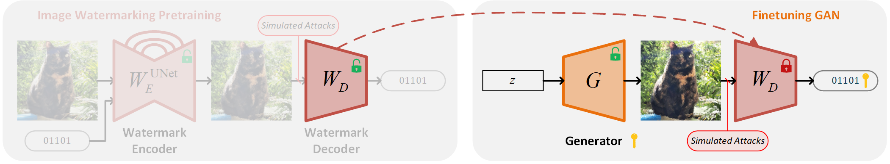
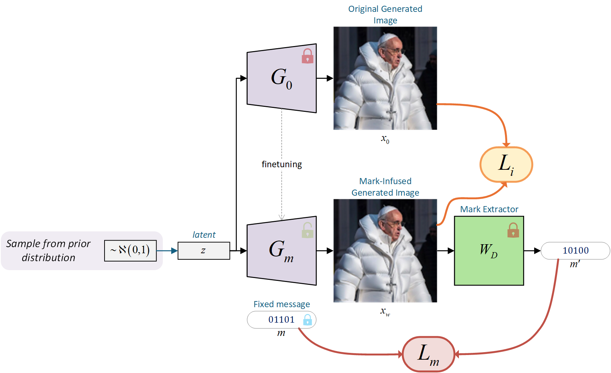
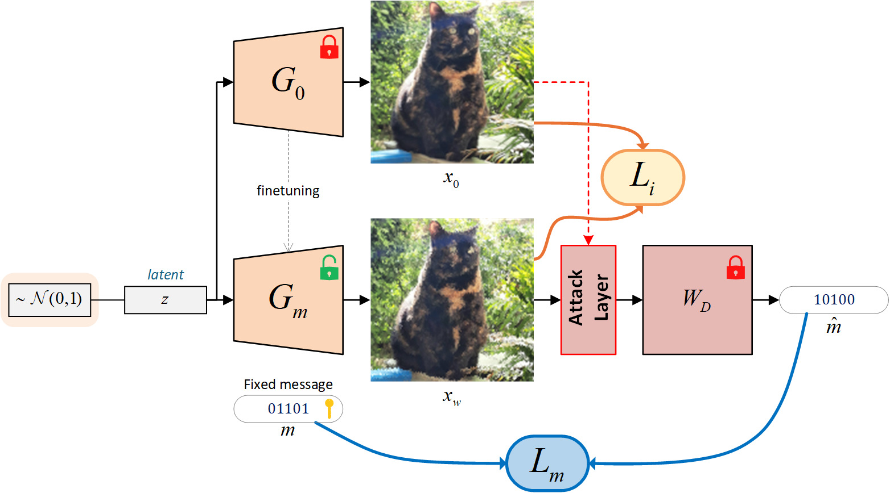
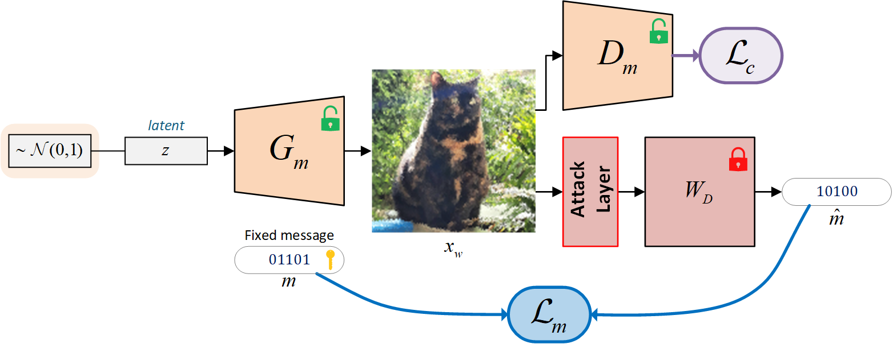
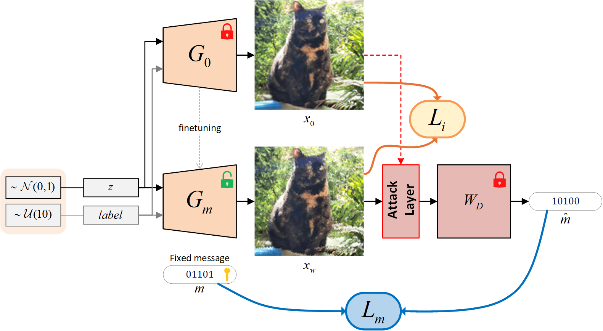

Stable Signature for GAN
------

This code was modified from
[Stable Signature codebase](https://github.com/facebookresearch/stable_signature).
Instead of fine-tuning the Latent Diffusion Model, we finetune a GAN to embed a merge-in watermark.

<p align="center">

</p>

## Setup

### Perceptual Losses

Before you can train with the Watson's perceptual losses, you need to download the weights from
[this link](https://github.com/SteffenCzolbe/PerceptualSimilarity/tree/master/src/loss/weights)
and then put them on the folder \../ckpts/loss` (or define the path with \--loss_i_dir`).

## Key Ideas

### Fine-tuning GAN:

Instead of fine-tuning the decoder of a LDM as in the original work, we opt to finetune the generator of a GAN.
In this case, the notions of dataset and epoch are discarded as we can simply sample from the prior distribution.
The basic scheme is as follows:

<p align="center">

</p>

We also proposed to use a modified scheme with the attack simulation layer:
<p align="center">

</p>

And an experimental scheme called "the adversarial scheme":
<p align="center">

</p>

## Usage

These are the commands to reproduce the experiments we have conducted:

### Fine-tuning DCGAN

#### Experiments on MNIST

- Baseline scheme:
```cmd
python finetune_dcgan.py mnist --num_keys 1 \
    --num_bits 32 --img_size 28 --img_channels 1 --batch_size 32 \
    --steps 8000 --eval_steps 400 --eval_freq 800 \
    --generator_ckpt ../ckpts/dcgan_generator_mnist.pth \
    --decoder_path ../ckpts/hidden_mnist_unet.pth \
    --attack_layer none \
    --loss_i watson-vgg --loss_w bce \
    --lambda_i 1 --lambda_w 1
```
- Baseline scheme with attack layer:
```cmd
python finetune_dcgan.py mnist_attack --num_keys 1 \
    --num_bits 32 --img_size 28 --img_channels 1 --batch_size 32 \
    --steps 8000 --eval_steps 400 --eval_freq 800 \
    --generator_ckpt ../ckpts/dcgan_generator_mnist.pth \
    --decoder_path ../ckpts/hidden_mnist_unet.pth \
    --attack_layer hidden \
    --loss_i watson-vgg --loss_w bce \
    --lambda_i 1 --lambda_w 1
```
- Adversarial scheme:
```cmd
python finetune_dcgan_adv.py mnist_adv --dataset MNIST --num_keys 1 \
    --num_bits 32 --img_size 28 --img_channels 1 --batch_size 32 \
    --steps 8000 --eval_steps 400 --eval_freq 800 \
    --generator_ckpt ../ckpts/dcgan_generator_mnist.pth \
    --discriminator_ckpt ../ckpts/dcgan_discriminator_mnist.pth \
    --decoder_path ../ckpts/hidden_mnist_unet.pth \
    --attack_layer none \
    --loss_w bce --loss_c bce \
    --lambda_w 1 --lambda_c 1
```
- Adversarial scheme with attack layer:
```cmd
python finetune_dcgan_adv.py mnist_adv_attack --dataset MNIST --num_keys 1 \
    --num_bits 32 --img_size 28 --img_channels 1 --batch_size 32 \
    --steps 8000 --eval_steps 400 --eval_freq 800 \
    --generator_ckpt ../ckpts/dcgan_generator_mnist.pth \
    --discriminator_ckpt ../ckpts/dcgan_discriminator_mnist.pth \
    --decoder_path ../ckpts/hidden_mnist_unet.pth \
    --attack_layer hidden \
    --loss_w bce --loss_c bce \
    --lambda_w 1 --lambda_c 1
```

#### Experiments on CIFAR10

- Baseline scheme:
```cmd
python finetune_dcgan.py cifar10 --num_keys 1 \
    --num_bits 48 --img_size 32 --batch_size 32 \
    --steps 8000 --eval_steps 400 --eval_freq 800 \
    --generator_ckpt ../ckpts/dcgan_generator_cifar10.pth \
    --decoder_path ../ckpts/hidden_coco_unet.pth \
    --attack_layer none \
    --loss_i watson-vgg --loss_w bce \
    --lambda_i 1 --lambda_w 1
```
- Baseline scheme with attack layer:
```cmd
python finetune_dcgan.py cifar10_attack --num_keys 1 \
    --num_bits 48 --img_size 32 --batch_size 32 \
    --steps 8000 --eval_steps 400 --eval_freq 800 \
    --generator_ckpt ../ckpts/dcgan_generator_cifar10.pth \
    --decoder_path ../ckpts/hidden_coco_unet.pth \
    --attack_layer hidden \
    --loss_i watson-vgg --loss_w bce \
    --lambda_i 1 --lambda_w 1
```
- Adversarial scheme:
```cmd
python finetune_dcgan_adv.py cifar10_adv --dataset CIFAR10 --num_keys 1 \
    --num_bits 48 --img_size 32 --img_channels 3 --batch_size 32 \
    --steps 8000 --eval_steps 400 --eval_freq 800 \
    --generator_ckpt ../ckpts/dcgan_generator_cifar10.pth \
    --discriminator_ckpt ../ckpts/dcgan_discriminator_cifar10.pth \
    --decoder_path ../ckpts/hidden_coco_unet.pth \
    --attack_layer none \
    --loss_w bce --loss_c bce \
    --lambda_w 1 --lambda_c 1
```
- Adversarial scheme with attack layer:
```cmd
python finetune_dcgan_adv.py cifar10_adv_attack --dataset CIFAR10 --num_keys 1 \
    --num_bits 48 --img_size 32 --img_channels 3 --batch_size 32 \
    --steps 8000 --eval_steps 400 --eval_freq 800 \
    --generator_ckpt ../ckpts/dcgan_generator_mnist.pth \
    --discriminator_ckpt ../ckpts/dcgan_discriminator_mnist.pth \
    --decoder_path ../ckpts/hidden_coco_unet.pth \
    --attack_layer hidden \
    --loss_w bce --loss_c bce \
    --lambda_w 1 --lambda_c 1
```

### Evaluating DCGAN

To evaluate, run `python eval_dcgan.py` with identical parameters as `finetune_dcgan.py`
(except training-exclusive parameters).
This script will load and test the checkpointed weights against many different attacks.

### Finetuning R3GAN

This section is just to showcase that we can also finetune a conditional GAN:
<p align="center">

</p>

Unlike DCGAN (probably the worst performing GAN architecture),
R3GAN (https://arxiv.org/abs/2501.05441) is one of the SOTA methods that generates from the z-dimension, which aligns
with the scheme we showed above.
We finetune the conditional architecture provided by the authors in https://github.com/brownvc/R3GAN,
thus, requiring the pre-trained weights.
You can download it using ``python tools/download_weights.py --download_r3gan``.

- Baseline scheme with attack layer:
```cmd
python finetune_r3gan.py r3gan_cifar10 --num_keys 1 \
    --num_bits 48 --img_size 32 --img_channels 3 --batch_size 32 \
    --steps 8000 --eval_steps 100 --eval_freq 800 \
    --generator_ckpt ../ckpts/r3gan_cifar10.pkl \
    --msg_decoder_path ../ckpts/hidden_replicate.pth \
    --clf_ckpt ../ckpts/clf/resnet18_cifar10.pth \
    --attack_layer hidden \
    --loss_i watson-vgg --loss_w bce \
    --lambda_i 1 --lambda_w 0.05
```

### Demo

A demo file can be found in [`notebooks/demo.ipynb`](notebooks/demo.ipynb).
